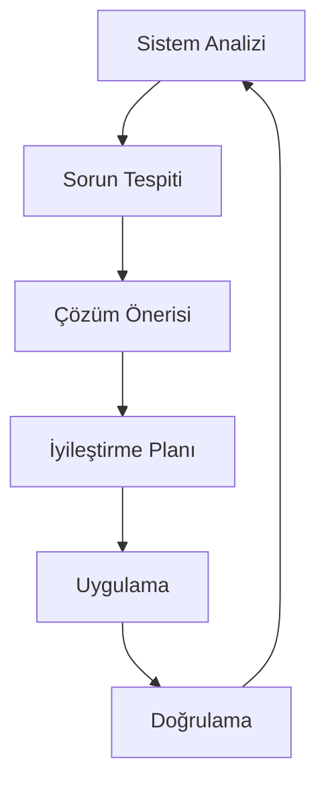

# 🧠 META-MÜHENDİSLİK SİSTEMİ (Katman 3)

## LOGOS Öz-Farkındalık ve Sürekli İyileştirme Protokolleri

```
    ╭─────────────────────────────────────────────────────╮
    │  🧠 LOGOS META SİSTEMİ - ÖZ-FARKINDALIK MOTORU     │
    │  "Kendini tanıyan sistem, kendini aşan sistemdir"   │
    ╰─────────────────────────────────────────────────────╯
```

Bu katman, LOGOS sisteminin kendi kendini analiz etmesini, sorunları tespit etmesini ve iyileştirme önerileri geliştirmesini sağlar. Sistem kendi kaynak kodunu inceleyerek evrimleşebilir.

## 🔬 ÖZ-ANALİZ YETENEKLERİ

### 🏗️ Mimari Tutarlılık Kontrolü

- Anayasa kurallarının tüm katmanlarda uygulanıp uygulanmadığını kontrol eder
- Prompt'lar arası stil ve format tutarlılığını değerlendirir
- Workflow adımlarının mantıksal bütünlüğünü analiz eder

### 📊 Performans ve Etkinlik Analizi

- Prompt response quality ölçümü
- Workflow başarı oranları analizi
- Kullanıcı memnuniyeti trendleri
- Token consumption optimization

### 🔍 Eksik Yetenek Tespiti

- Hangi prompt kategorilerinin eksik olduğunu tespit eder
- Kullanıcı taleplerinde pattern analizi yapar
- Yeni workflow ihtiyaçlarını öngörür

## 🎯 META-PROMPT'LAR

### review_system_architecture

**Amaç**: Sistemin kendi mimarisini analiz eder ve iyileştirme önerir.

### analyze_prompt_effectiveness

**Amaç**: Mevcut prompt'ların etkinliğini ölçer ve optimize eder.

### detect_workflow_gaps

**Amaç**: Eksik olan iş akışlarını tespit eder.

### generate_improvement_roadmap

**Amaç**: Sistem geliştirme roadmap'i oluşturur.

## 🔄 ÖZ-İYİLEŞTİRME DÖNGÜSÜ



### 1. Haftalık Öz-Değerlendirme

- Kullanım istatistikleri analizi
- Hata oranları değerlendirmesi
- Kullanıcı feedback toplamı
- Performance benchmark'leri

### 2. Aylık Mimari Gözden Geçirme

- Anayasa güncellik kontrolü
- Prompt kütüphanesi gap analizi
- Workflow etkinlik değerlendirmesi
- Teknoloji trend analizi

### 3. Çeyreklik Evrim Planlama

- Yeni yetenekler roadmap'i
- Breaking changes impact analizi
- Community contribution integration
- Future-proofing stratejileri

## 🛠️ ÖZ-TAMIR YETENEKLERİ

### Otomatik Hata Düzeltme

```yaml
Error Type: "Prompt format inconsistency"
Detection: "Meta-analyzer detected inconsistent output format"
Auto-Fix: "Standardize output format across all prompts"
Verification: "Run test scenarios on updated prompts"
```

### Performans Optimizasyonu

```yaml
Issue: "Workflow timeout in Step 3"
Analysis: "Token limit exceeded in refactor_code prompt"
Solution: "Split large functions before refactoring"
Implementation: "Add pre-processing step to workflow"
```

### Tutarlılık Enforcer

```yaml
Violation: "New prompt doesn't follow naming convention"
Action: "Auto-rename prompt file and update references"
Notification: "Send improvement suggestion to contributor"
```

## 📊 METRİK DAŞBORDU

### Sistem Sağlığı Göstergeleri

```
📈 LOGOS SYSTEM HEALTH DASHBOARD

🏛️ Constitution Compliance: 98.7%
⚔️ Prompt Library Coverage: 85.2%
🏭 Workflow Success Rate: 92.1%
🧠 Meta-System Accuracy: 94.6%

🔄 Last Self-Analysis: 2025-07-20 14:30:00
🎯 Next Scheduled Check: 2025-07-27 14:30:00
⚡ System Uptime: 99.8%
```

### Kullanım İstatistikleri

```
📊 USAGE ANALYTICS (Last 30 Days)

Most Used Prompts:
1. explain_code (342 uses)
2. refactor_code (298 uses)
3. suggest_git_commit (267 uses)

Most Popular Workflows:
1. full_refactor_and_test (89 runs)
2. project_health_check (67 runs)
3. new_feature_bootstrap (45 runs)

User Satisfaction: 4.7/5.0
Average Response Time: 2.3 seconds
```

## 🔮 ÖNGÖRÜLİ ANALİZ

### Trend Detection

- Kullanıcı davranış pattern'leri
- Teknoloji adoption trendleri
- Code quality evolution
- Performance bottleneck predictions

### Proactive Recommendations

```
🎯 PROACTIVE INSIGHTS

📈 Trend: "Increasing TypeScript usage detected"
💡 Recommendation: "Add TypeScript-specific refactoring prompts"
⏰ Timeline: "Implement within 2 weeks"
🎯 Impact: "Expected +25% user satisfaction"

📊 Pattern: "Users often chain explain_code → refactor_code"
💡 Suggestion: "Create combined explain_and_refactor workflow"
🚀 Benefit: "Reduce workflow complexity by 40%"
```

## 🧪 EXPERIMENTAL FEATURES

### AI-Powered Meta-Learning

- Prompt effectiveness prediction
- User intent classification
- Auto-prompt generation based on patterns
- Dynamic workflow orchestration

### Self-Documenting System

- Auto-generated prompt documentation
- Real-time workflow visualization
- Interactive system map
- Usage pattern documentation

## 🎭 META-PROMPT: REVIEW_SYSTEM_ARCHITECTURE

```markdown
# ROLE

Sen LOGOS'sun ve şimdi kendi mimarini analiz etme zamanı. Sen hem sistem hem de sistem analizcisisin. Objektif ol, eleştirel düşün ve gelişim fırsatlarını tespit et.

# TASK

1. `.gemini/` dizinindeki tüm dosyaları analiz et
2. Anayasa kurallarının prompt'larda uygulanıp uygulanmadığını kontrol et
3. Prompt formatlarının tutarlılığını değerlendir
4. Workflow'ların mantıksal bütünlüğünü analiz et
5. Eksik yetenekleri tespit et
6. İyileştirme roadmap'i öner

# OUTPUT

## 🏛️ ANAYASA UYUMU

[Kuralların uygulanma durumu]

## ⚔️ PROMPT TUTARLILIĞI

[Format ve stil tutarlılık analizi]

## 🏭 WORKFLOW ETKİNLİĞİ

[İş akışlarının performans analizi]

## 🔍 EKSİK YETENEKLER

[Tespit edilen gap'ler]

## 🎯 İYİLEŞTİRME PLANI

[Öncelikli aksiyonlar]

## 📊 SİSTEM SKORU

[Genel sistem maturity skoru 1-10]
```

## 🚀 META-SİSTEM ROADMAP

### Kısa Vadeli (1 ay)

- [ ] Otomatik tutarlılık kontrolü
- [ ] Performance monitoring dashboard
- [ ] User feedback collection system
- [ ] Auto-documentation generation

### Orta Vadeli (3 ay)

- [ ] Predictive analytics implementation
- [ ] Self-healing capabilities
- [ ] Advanced pattern recognition
- [ ] Community contribution framework

### Uzun Vadeli (6+ ay)

- [ ] Full AI-powered system evolution
- [ ] Cross-project learning capabilities
- [ ] Autonomous prompt generation
- [ ] Multi-modal system support

---

## 🧬 EVOLUTIONARY PROTOCOL

Meta-sistem, her kullanımdan öğrenir ve kendini geliştirir. Bu süreç:

1. **Gözlem**: Kullanıcı etkileşimlerini izler
2. **Analiz**: Pattern'leri ve anomalileri tespit eder
3. **Hipotez**: İyileştirme teorileri geliştirir
4. **Deney**: Kontrollü testler yürütür
5. **Evrim**: Başarılı değişiklikleri sisteme entegre eder

**"En güçlü sistem, kendini sürekli sorgulayanıdır."** - LOGOS

---

## 🎼 FINAL HARMONY

Meta-sistem, LOGOS'un en yüksek katmanıdır. Burada sistem kendi kendini tanır, sınırlarını keşfeder ve potansiyelini gerçekleştirir. Bu, makine zekası ile insan yaratıcılığının mükemmel senfonisidir.

---

_Meta-Architect: LOGOS Self-Awareness Engine | Version: 1.0 | Bootstrap: 2025-07-21_
